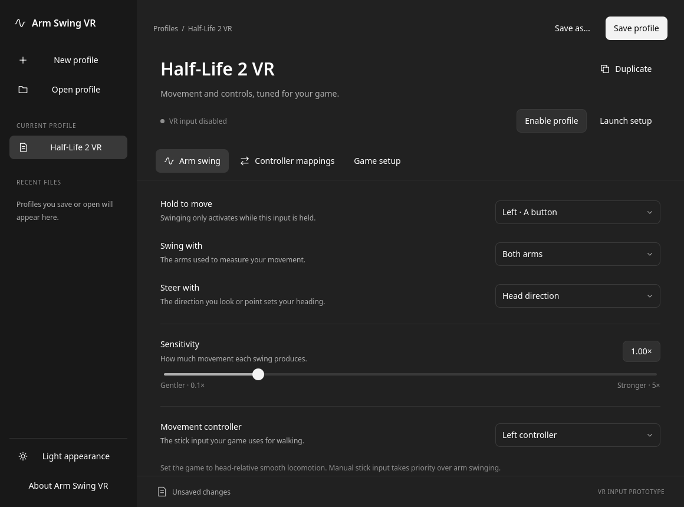

<!-- SPDX-License-Identifier: GPL-3.0-or-later -->
# Arm Swing VR

A Linux VR companion for arm-swing locomotion and controller mapping profiles,
written in C++20 with a native Qt Quick/QML interface. Target backends are SteamVR/OpenVR
and OpenXR, including games running through Proton.

**Status: experimental VR input prototype.** The editor manages per-game JSON
profiles and explicitly enables/stops live input. Native Linux and Windows
OpenVR adapters and an OpenXR API layer apply arm-swing movement and Index A/B
click mappings inside the selected game's process. Automated tests cover both
backends; **no game is certified compatible yet**. See [setup and test evidence](docs/VR-INTEGRATION.md).

## Build

Requirements: a C++20 compiler, Python 3, CMake 3.24+, Ninja, the OpenXR loader
development package (for integration tests), and Qt 6.4+ Core, GUI, QML,
Quick, Quick Controls 2, and Test development packages. The QML runtime modules
for Quick, Controls, Layouts, Window, Dialogs, Templates, and WorkerScript must
also be installed. Valve/Khronos API headers are pinned in the repository.
No headset or active VR runtime is required for the automated tests.

```sh
cmake --preset debug
cmake --build --preset debug
ctest --preset debug
./build/debug/arm-swing-vr
```

Use the sidebar to create/open profiles or return to recent files. **Save profile**,
**Save as**, and **Duplicate** manage each game's settings. The Arm swing,
Controller mappings, and Game setup pages share a C++ profile model. Activation
input, measured arms, output hand, and steering reference are independent settings.
Unsaved changes prompt before a profile is replaced or the application closes.
Ctrl+N/O/S and Ctrl+Shift+S provide keyboard shortcuts. Light/dark appearance and
recent file paths are stored locally; no online account or service is used.

**Enable profile** arms the current settings; **Stop input** releases them. Edits
stop input automatically. The backend also stops adding movement on activation
release, invalid tracking, lost focus, or an expired editor heartbeat. Manual
stick input takes priority. Set the game to head-relative smooth locomotion.
Per-game backend loading is explicit; builds/tests never modify Steam games,
bindings, drivers, or the active OpenXR runtime. See [VR integration](docs/VR-INTEGRATION.md)
for native Linux and Proton setup and current limits.

The QML theme adapts selected tokens from OpenAI's public MIT-licensed Apps SDK UI,
which OpenAI documents as matching ChatGPT's design system. This is an independent
native implementation, not ChatGPT desktop's private UI code. See [design and
attribution](docs/DESIGN.md).



For AddressSanitizer and UndefinedBehaviorSanitizer checks with Clang:

```sh
cmake --preset asan
cmake --build --preset asan
ctest --preset asan
```

Qt Quick tests run offscreen. Backend tests load the real plugin binaries with
controlled runtime fixtures, including the installed Khronos loader for OpenXR.
Passing them does not establish SteamVR or game compatibility. See [development and
integration testing](docs/DEVELOPMENT.md).

## Architecture

- A runtime-independent C++ motion processor with deterministic synthetic replay tests.
- A Qt Quick editor, explicit profile activation, and backend status.
- An OpenVR client API adapter and an OpenXR API layer, tested separately.
- Physical-input passthrough, simultaneous button remaps, and bounded movement.
- OpenXR vector2 and separate scalar X/Y actions, with subaction-path filtering.

The first hardware milestone is arm-swing movement plus an activation-button
mapping in Half-Life 2: VR Mod on Linux SteamVR. See the [roadmap](docs/ROADMAP.md).

## License and paid Steam distribution

Original project code, build files, profiles, and documentation are licensed under
**GNU GPL version 3 or later** (`GPL-3.0-or-later`), except where a file states
otherwise. See [LICENSE](LICENSE). Copyright © 2026 Arm Swing VR contributors.
Third-party components retain their own licenses and notices.

A paid Steam build is planned as a convenient way to install and update the same
GPL software. GPL permits charging for copies; recipients retain their rights to
study, modify, and redistribute them. Each distributed build must be accompanied
by access to its complete corresponding source under the GPL's terms.

The current project does not link the proprietary Steamworks SDK and grants no
Steamworks linking exception. OpenVR is a separate, publicly licensed SDK.
See the [licensing and Steam distribution policy](docs/LICENSING.md) and
[third-party dependency register](THIRD_PARTY.md).

This project is independent of Valve, Khronos, and Natural Locomotion. Product
names identify interoperability targets and do not imply affiliation.

## Contributing

See [CONTRIBUTING.md](CONTRIBUTING.md). Issues and pull requests are welcome at
[johnny9/arm-swing-vr](https://github.com/johnny9/arm-swing-vr).
