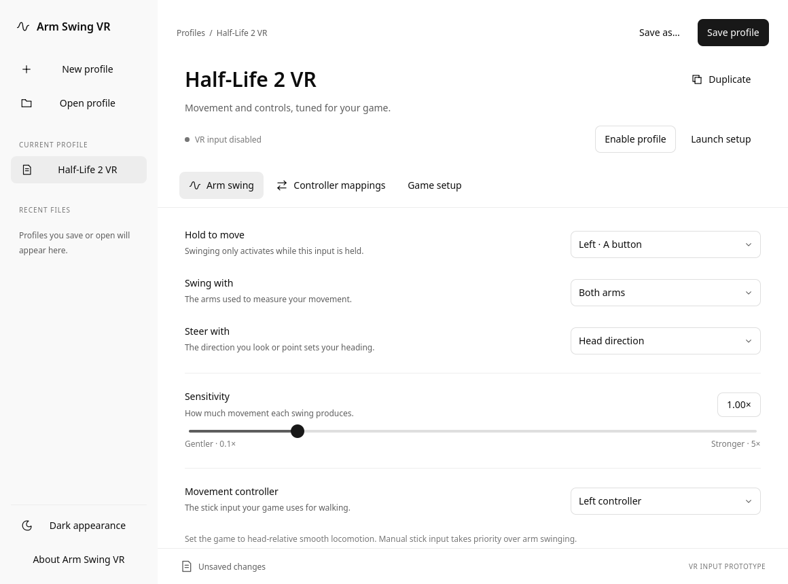

<!-- SPDX-License-Identifier: GPL-3.0-or-later -->
# Native QML design

Arm Swing VR uses Qt Quick Controls with original QML components and a C++ profile
controller. The application does not embed a web view or call an OpenAI API.

OpenAI's [public UI guidance](https://developers.openai.com/plugins/concepts/ui-guidelines)
identifies Apps SDK UI as a component library that matches ChatGPT's design
system. That public library is web-oriented. We adapt selected MIT-licensed CSS
tokens to native QML, rather than claim access to ChatGPT desktop's private
implementation. Exact source revision, paths, and modifications are recorded in
[THIRD_PARTY.md](../THIRD_PARTY.md).

## Shared foundations

`qml/Theme.qml` provides dark/light semantic colors, 4 px spacing foundations,
8/12 px control radii, and restrained monochrome actions. Qt's platform system
font is used; no OpenAI font or brand assets are bundled. The sidebar is a quieter
surface than the main editor, with a high-contrast primary save action and subtle
dividers. Color is not the sole way to communicate status.

`AppButton`, `AppField`, `AppCombo`, `InputPicker`, and `SettingRow` provide reusable
native controls. Focus indicators, keyboard selection, accessible names, text
selection, and a scrollable editor remain available. Input names are readable;
custom raw input paths are an explicit advanced choice.

The sidebar offers new/open actions, the current document, and up to ten recent
files. Separate pages group movement, mappings, and game identity. Changes remain
in the C++ draft when switching pages. Mapping rows use a stable item model to
avoid losing focus while editing. New/open/recent/close transitions share one
unsaved-changes flow. Save validation and atomic writes remain in C++.

Screenshots use a test profile named Half-Life 2 VR. They demonstrate layout, not
game compatibility. The header provides explicit enable/stop controls, backend
connection status, and per-game launch setup. Editing or switching a profile
stops live input; a profile must be enabled again after changing its settings.

